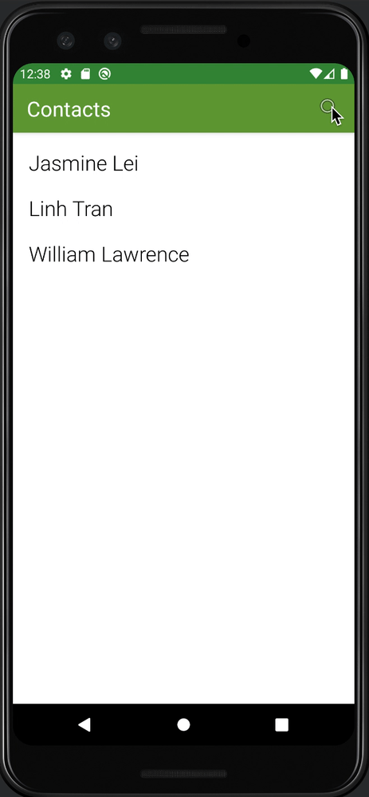
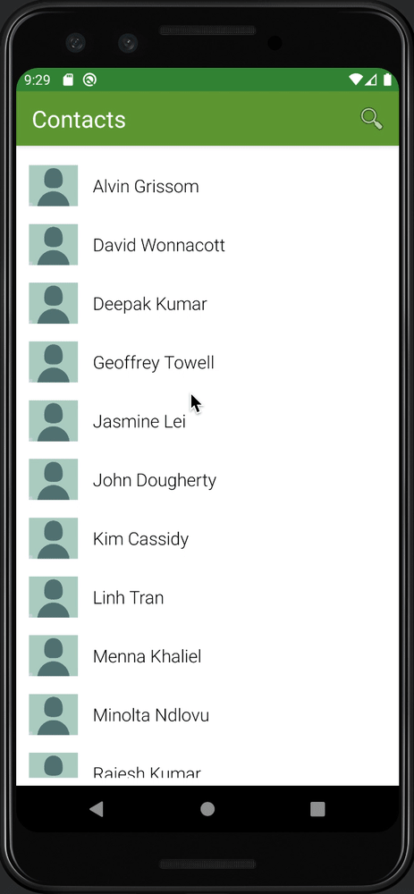

Original App Design Project - README Template
===

# Fake Caller App

## Table of Contents
1. [Overview](#Overview)
1. [Product Spec](#Product-Spec)
1. [Wireframes](#Wireframes)
2. [Schema](#Schema)

## Overview
### Description
A Fake Caller App creates fake calls that might be helpful in dangerous situations during alone night-time walking home. 

### App Evaluation
- **Category:** Utility app
- **Mobile:** Works like the Android phone app
- **Story:** Help protect women/girls during alone night-time walking home
- **Market:** Women who don't feel safe walking at night
- **Habit:** Possibly daily use
- **Scope:** Might be a bit challenging because of use of different APIs and mimicking the phone app interface

## Product Spec

### 1. User Stories (Required and Optional)

**Required Must-have Stories**

- [x] User can view a list of contacts.
- [x] User can make a fake call to one contact and view "Calling" screen.
- [ ] User can switch to an emergency activity that makes real call to emergency number.
- [ ] User can schedule an incoming phone call.

**Optional Nice-to-have Stories**

- [ ] User can add a list of contacts of their choice.
- [ ] User can make customized fake calls to different contacts.
- [ ] User can even fake Facetime.
- [x] User can use the search bar to find contacts.

### 2. Screen Archetypes

* Contact List (Stream)
   * User can view a list of contacts.
* Contact Actions (Detail) (or a popup screen within contact list?)
   * User can initiate a fake outgoing call.
   * User can schedule an incoming call.
* Outgoing Call Activity (Detail)
   * User can make a fake call to one contact and view "Calling" screen.
   * User can get fake responses during the call.
   * User can switch to an emergency activity that makes real call to emergency number.
* Incoming Call Activity (Detail)
   * User can receive fake phone coming.

### 3. Navigation

**Tab Navigation** (Tab to Screen)

* Emergency Call
* Contact List

**Flow Navigation** (Screen to Screen)

* Contact List
   * Contact Actions
* Contact Actions
   * Incoming Call
   * Outgoing Call
* Incoming Call
   * Contact List
* Outgoing Calls
   * Contact List 

## Schema 
### Models
#### Contact

   | Property      | Type     | Description |
   | ------------- | -------- | ------------|
   | name          | String   | contact name |
   | image         | File     | initials of contact |
   | audio         | File     | recorded audio "call" |
   | duration      | Time     | length of audio call |

### Networking
* Contact List
  * (OPTIONAL) (Create/POST) Create a new contact
     ``` swift
     //Uses the ParseBackend to create a new contact
     public void onCreate() {
        super.onCreate();
        ParseObject.registerSubclass(ContactInfo.class);
        Parse.initialize(new Parse.Configuration.Builder(this)
                .applicationId("1q59So2R8sdi1XIqOUWOgIpvU4zPgCPFnf5rzSY7")//placeholder id
                .clientKey("oM0oGHh8TX2mLcQkH7UFChEaLSHQrbnQipKiiLB9")//placeholder clientKey
                .server("https://parseapi.back4app.com")
                .build()
        );
    }
     ```
  * (OPTIONAL) (Delete) Delete existing contact
    ``` swift
    ContactInfo.deleteInBackground();
    ```
  * (OPTIONAL) (Update/PUT) Update contact info
    ```swift
    ParseQuery<ParseObject> query = ParseQuery.getQuery("ContactInfo");
    // Retrieve the object by id
    query.getInBackground("your_contact_info_id", new GetCallback<ParseObject>() {
      public void done(ParseObject ContactInfo, ParseException e) {
        if (e == null) {
          // Update it with some new data. In this case, only contactName and phoneNumber
          // will get sent to Parse Server. 
          ContactInfo.put("contactName", NewName);
          ContactInfo.put("phoneNumber", NewNumber);
          ContactInfo.saveInBackground();
        }
      }
    });
    ```
  * (Read/GET) Get contact info for all contacts
    ```swift
    // queryContacts() method?
    ParseQuery<Contact> query = ParseQuery.getQuery(Contact.class);
    query.include(Contact.KEY_CONTACT);
    query.addAscendingOrder(Contact.KEY_CONTACT);
    query.findInBackground(new FindCallback<Contact>() {
        @Override
        public void done(List<Contact> contacts, ParseException e) {
            if (e != null) {
                Log.e(TAG, "Issue with getting contacts, e);
                return;
            }
            Log.i(TAG, “Successfully retrieved contacts”);
            allContacts.addAll(contacts);
            adapter.notifyDataSetChanged();
        }
    });
    ```
    
* Outgoing Call / Call View
  * (Read/GET) Get audio file and duration for specific contact, set timer, and end call after
    ```swift
    protected void queryContact(String contactName) {
        ParseQuery<Contact> query = ParseQuery.getQuery(Contact.class);
        query.whereEqualTo(“contactName”, name);
        query.getFirstInBackground(new FindCallback<Contact>() {
            @Override
            public void done(Contact contact, ParseException e) {
                if (e != null) {
                    Log.e(TAG, "Issue with getting contact, e);
                    return;
                }
                Log.i(TAG, “Successfully retrieved contact”);
                // bind contact into to call screen somehow... (TBD)
            }
        });
    }
    ````
    
- [OPTIONAL: List endpoints if using existing API such as Yelp]

## Wireframes


## Build Progress Walkthroughs
### Sprint 1


### Sprint 2


### Sprint 3

### Sprint 4
